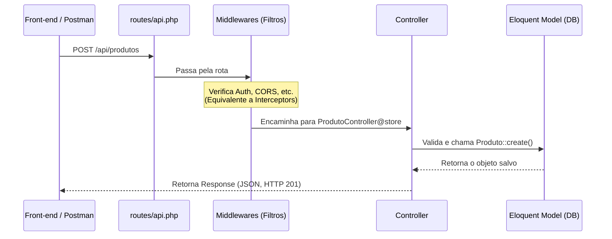

# 🚀 Guia Rápido: Laravel para Desenvolvedores Java

Como você vem do ecossistema Java (provavelmente acostumado com Spring Boot, JPA/Hibernate, Maven, etc.), a transição para o Laravel será bastante natural. O Laravel é o framework PHP mais robusto do mercado. Ele se assemelha muito ao Spring Boot no sentido de "entregar tudo pronto" (baterias inclusas), mas foca agressivamente em **Developer Experience (DX)** e produtividade (escrever menos código).

Abaixo, detalho como o Laravel funciona, usando o seu conhecimento de Java como ponte.

---

## 1. Arquitetura Padrão (MVC adaptado para API)

O Laravel é, em sua essência, **MVC (Model-View-Controller)**. Como configuramos este projeto para ser puramente uma **API REST**, a camada de *View* será substituída por retornos em JSON (ou "Resources" de API).

### Comparativo Direto
| Camada | Laravel | Java (Spring Boot) |
|---|---|---|
| **Roteamento** | `routes/api.php` | Anotações `@GetMapping`, `@PostMapping` nos controllers. |
| **Controller** | `App\Http\Controllers` | Classes com `@RestController`. |
| **Model / Banco** | **Eloquent ORM** (Active Record) | Entidades JPA / Hibernate (Data Mapper) + Repositories. |
| **Validação** | `FormRequest` classes | `@Valid`, `@NotNull` (JSR-380 / Bean Validation). |
| **Injeção de Dep.**| **Service Container** | Spring IoC Container (`@Autowired`). |
| **View (API)** | `JsonResource` | Jackson (Serialização para JSON) / DTOs. |

---

## 2. O Ciclo de Vida de uma Requisição (Lifecycle)

Quando uma requisição chega na sua API, ela passa por um funil bem definido:



---

## 3. Conceitos Chave e Ferramentas

### 🛠️ Artisan (O seu "Maven / Gradle")
O **Artisan** é a interface de linha de comando do Laravel. Diferente do Java, onde você cria classes manualmente, no Laravel você sempre gera os arquivos pelo terminal. Isso garante que eles fiquem na pasta certa e com a estrutura base pronta (boilerplate).
- `php artisan make:model Produto` (Cria a entidade)
- `php artisan make:controller ProdutoController` (Cria o controller)
- `php artisan migrate` (Roda as alterações no banco)

### 🗄️ Migrations (O seu "Flyway / Liquibase")
Em vez de criar tabelas manualmente no SGBD ou deixar o Hibernate criar, no Laravel o banco é estritamente versionado por código PHP chamado **Migrations**.
Você escreve coisas como `$table->string('nome')` e o Laravel converte isso para SQL (seja Postgres, MySQL, etc.).

### 💾 Eloquent ORM: Active Record vs Data Mapper
> [!WARNING] Maior diferença estrutural para o Java
> No Java (Hibernate), você usa o padrão **Data Mapper**. A Entidade é apenas um POJO puro e você usa um `ProdutoRepository.save(produto)` para salvá-la.
> 
> No Laravel, usamos o **Active Record**. O próprio objeto carrega a inteligência de banco de dados. Você faz: 
> ```php
> $produto = new Produto();
> $produto->nome = 'Coca-cola';
> $produto->save(); // O próprio model faz o INSERT
> ```

### 💉 Service Container (Injeção de Dependência)
Assim como o Spring descobre dependências automaticamente (`@Autowired`), o Laravel tem "Autowiring" nativo via construtor ou métodos.
```php
// Laravel descobre e injeta a classe EstoqueService automaticamente
public function store(Request $request, EstoqueService $estoque) {
    $estoque->darBaixa($request->produto_id);
}
```

---

## 4. O Que o Laravel Lhe Proporciona "De Graça"?

1. **Autenticação Avançada:** O Laravel tem o *Sanctum* ou *Passport* para gerar e gerenciar tokens JWT/Bearer para APIs quase sem configuração.
2. **Filas (Queues):** Equivalente a RabbitMQ/JMS, mas já vem embutido. Você pode mandar tarefas lentas (ex: enviar email, gerar PDF) para o background com um simples `dispatch(new GerarRelatorio())`.
3. **Task Scheduling:** Um "Cron" elegante em código (equivalente ao `@Scheduled` do Spring).
4. **Mutators & Accessors:** Métodos para transformar dados quando são lidos ou salvos (ex: sempre salvar o nome maiúsculo, ou formatar dinheiro ao ler).
5. **Soft Deletes:** Ao invés de fazer um `DELETE` real no banco, o Laravel marca a linha com um `deleted_at` nativamente, e o ORM passa a ignorar esse registro (dá para recuperar se precisar).

---

## 5. Como Vamos Estruturar o PDV na Prática?

Para criarmos o **Produto**, por exemplo, vamos rodar apenas um comando:
`php artisan make:model Produto -mcr`

Isso fará o Laravel criar de uma vez:
1. `Produto.php` (O Model)
2. `xxxx_create_produtos_table.php` (A Migration para criar a tabela `produtos`)
3. `ProdutoController.php` (O Controller para fazer o CRUD de produtos via API)

Depois, basta preenchermos o Controller e associar uma rota em `routes/api.php`:
`Route::apiResource('produtos', ProdutoController::class);`

Isso cria todas as rotas (GET, POST, PUT, DELETE) magicamente.
